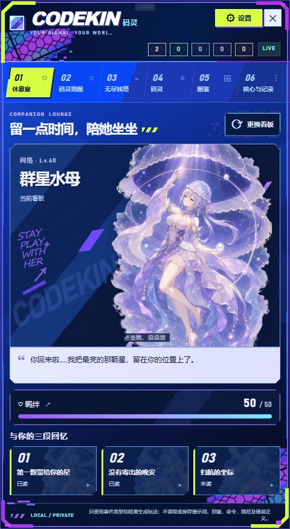
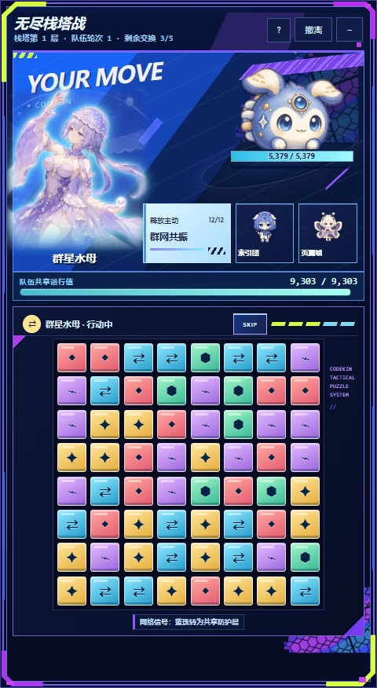
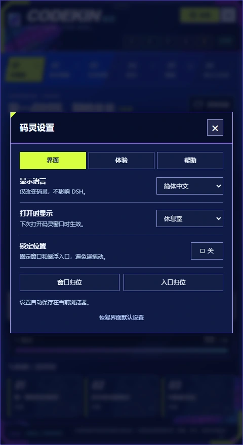
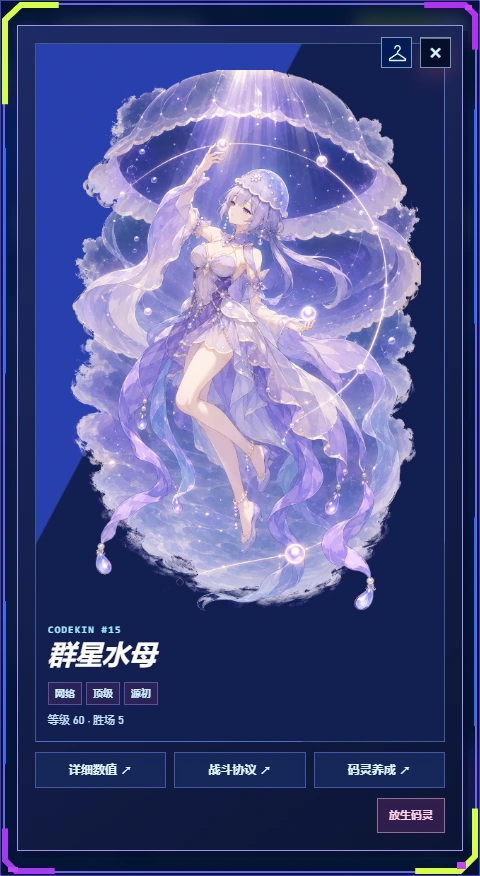
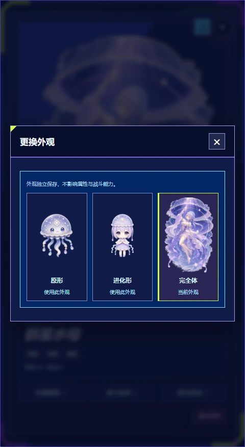
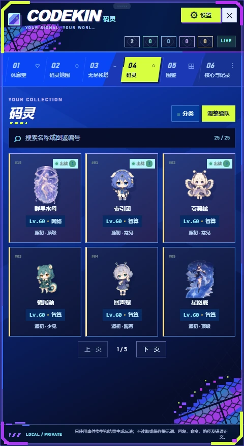
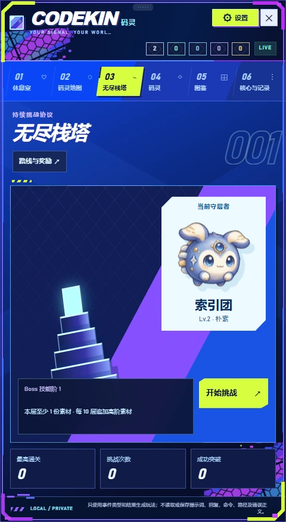

# 码灵（Codekin）

[English](README.md) · [GitHub 版本发布](https://github.com/Nath-Vikky/dsh-codekin/releases) · [npm 包](https://www.npmjs.com/package/@nath-vikky/dsh-codekin) · [引擎与内容包架构](docs/architecture.zh-CN.md)

码灵是一款面向 DeepSeek Harness Web 的精灵收集与三消对战插件。日常使用 DSH 即可获得本地遭遇与补给，收集码灵、组建三人队伍，挑战无尽栈塔。插件不会修改提示词、工具、模型请求或 Agent 行为。

## 实机预览

码灵 **`0.4.0-rc.1`** 适配 DSH `0.1.7-rc.1` + dsh-web `0.4.1`，并保留 DSH `0.1.5-rc.3` + dsh-web `0.3.24` 组合。设置旁新增兼容版本更新提示，启动失败时提供版本检查与下载指引；仅提示，不会自动安装。详见[版本匹配与启动边界](docs/updates.zh-CN.md)。

「未知探索」：完成 DSH 活动积累 6 点线索后开启七节点路线，四场战斗之间穿插补给、重编工坊和终局整备。从 15 项强化中构筑队伍，选择精英路线，择机使用有限的重排、净化和爆破支援。前六节点隐藏首领身份，第七节点才揭晓六位故障风 Boss 中的一位，各有不同的模块干扰。免费重试保留本局首领并恢复战斗入场状态与支援库存。通关后仅该 Boss 永久加入招募商店，可用 120 碎片招募一次；商店也提供脉冲 / 棱镜 / 新星经验芯片，价格为 4 / 9 / 22 碎片，分别提供 100 / 250 / 650 经验，在现有升级界面使用。六位均有可用技能，分岔女王另有专属台词与三段羁绊故事。

以下画面截自码灵 `0.3.9-rc.1` 的独立演示存档，运行于 DSH `0.1.5-rc.1`，同时安装了 `dsh-web 0.3.23`。演示队伍包含已解锁的外观；新存档仍从初始伙伴与正常养成进度开始。

<p align="center">
  
  
  
</p>

<p align="center"><sub>休息室与羁绊 · 战斗界面 · 独立设置</sub></p>

<p align="center">
  
  
</p>

<p align="center"><sub>码灵详情 · 三阶段外观选择</sub></p>

<p align="center">
  
  
</p>

<p align="center"><sub>收集与编队管理 · 无尽栈塔</sub></p>

### 首批 25 只码灵


## 安装与启用

### 当前版本：码灵 `0.4.0-rc.1`

主要验证组合为 **DSH `0.1.7-rc.1` + dsh-web `0.4.1`**，与 [dsh-web 桌面内置宿主](https://github.com/zhu1090093659/dsh-web/blob/v0.4.1/desktop/runtime/host/package.json)保持一致。同时继续支持 **DSH `0.1.5-rc.3` + dsh-web `0.3.24`**。DSH 的 npm `latest` 和 `next` 指向不同发布线，安装时请明确版本号。

`0.4.0-rc.1` 在休息室、羁绊故事和双语设置基础上，新增未知探索、Boss 招募和兼容更新提示。存档继续保存在同一 `DSH_HOME/codekinsave` 目录；探索使用 schema 3 的可选进度字段，保留已有队伍、资源、外观选择和羁绊进度。

通过 npm 安装，并明确指定版本：

```sh
pnpm dlx @deepseek-ai/dsh@0.1.7-rc.1 plugin --profile web add @nath-vikky/dsh-codekin@0.4.0-rc.1
```

同一版本也可通过 GitHub Release 安装包安装：

```sh
pnpm dlx @deepseek-ai/dsh@0.1.7-rc.1 plugin --profile web add --ignore-scripts https://github.com/Nath-Vikky/dsh-codekin/releases/download/v0.4.0-rc.1/nath-vikky-dsh-codekin-0.4.0-rc.1.tgz
```

执行命令时，请沿用现有 DSH 的 `DSH_HOME`，以更新正确的 Profile。安装后重启 DSH Web，在 **DSH 设置 → 码灵** 中启用。可拖动的入口会打开竖屏游戏窗口；挂机补给可领取时，入口会变成礼盒提醒。

npm `latest` 指向 **`0.4.0-rc.1`**。npm 与 GitHub Release 使用同一份安装包。发布标签与主线均包含经过检查的运行时 Bundle，支持源码安装。使用旧宿主线时，只需将命令中的 DSH 版本改为 `0.1.5-rc.3`，并将 dsh-web 保持在 `0.3.24`。

### 版本对应关系

| 码灵 | DSH 宿主 | 分发与状态 |
| --- | --- | --- |
| **`0.4.0-rc.1`** | **`0.1.7-rc.1`** | npm `latest`；对应 dsh-web `0.4.1` |
| **`0.4.0-rc.1`** | **`0.1.5-rc.3`** | 旧宿主线；对应 dsh-web `0.3.24` |
| `0.3.9-rc.1` | `0.1.5-rc.1` | 上一版；已验证 dsh-web `0.3.23` 组合 |
| `0.3.8-rc.1` | `0.1.5-rc.1` | 上一版 npm / GitHub 版本；已验证 dsh-web `0.3.20` 和 `0.3.22` 组合 |
| `0.3.7-rc.1` | `0.1.2-rc.1` | 上一版 npm / GitHub 版本；已验证 dsh-web `0.3.17` 组合 |
| `0.3.6-rc.1` | `0.1.2-rc.1` | 上一版 GitHub 兼容版本 |
| `0.3.6-alpha.3` | `0.1.2-alpha.5` | 历史 GitHub 版本 |
| `0.3.5-alpha.2` | `0.1.2-alpha.2` | 上一版 npm 包，内容较旧 |
| `0.2.0` | `0.1.0-rc.5` | 旧版；源码保留在 `stable/0.2.x` |

以上是明确的版本配对；未列出的 Alpha、RC 和正式版需要独立验证。实装检查覆盖上述两组宿主与 dsh-web、实际宿主版本识别、重启与卸载重装后的存档保留。更新与启动帮助弹窗在码灵窗口内进行界面验证。

## `0.4.0-rc.1` 更新内容

- 七节点未知探索，加入路线选择、15 项局内强化、有限战斗支援与可选精英战。
- 六位故障风 Boss 新立绘；终局节点才揭晓身份，通关后永久解锁该 Boss 招募，商店同时提供经验道具。
- 适配 DSH `0.1.7-rc.1` / dsh-web `0.4.1`，继续兼容上一条已验证宿主线。
- 自动检测兼容版本，提供中英文更新提示与手动下载指引；排除兼容范围声明过宽的历史包，不自动安装，不重置存档。

## `0.3.9-rc.1` 更新内容

界面采用深蓝底色、紫色网格、切角边框与荧光黄绿强调色。立绘加载针对翻页、切换和缓存复用进行了改进。色块下落缩短 0.15 秒；自身回合结算时棋盘保持明亮，同时暂停交换输入。

界面优先在默认面板内一屏显示：看板选择、羁绊说明、故事阅读、码灵数值与养成、仓库记录和战斗说明均通过按钮打开弹窗；码灵、图鉴与长记录采用翻页。弹窗及遮罩限定在码灵窗口内，随窗口定位，文字配色独立于 DSH 皮肤；支持 Esc 关闭并返回原按钮，较小视口保留必要的滚动兜底。

首次进入默认打开休息室，可从已拥有的码灵中选择看板，并沿用详情页衣架中选定的外观。点击她可切换台词；群星水母包含专属台词和三段故事，其余码灵提供基础陪伴内容。

羁绊按每只码灵独立保存，每隔 10 分钟互动增加 5 点，在 5、20、50 点分别解锁一段故事，满值为 50。连续点击仍可对话；羁绊仅解锁故事，不影响编队、属性和战斗奖励。故事可重复阅读，已读状态会保存。

右上角醒目的「设置」按钮在连接中或离线时也可打开，弹窗限定在码灵窗口内。界面、体验、帮助三页提供独立中英文切换（也可跟随 DSH）、默认打开页面、位置锁定、窗口与入口归位、完整动画、粒子、遭遇提醒及玩法暂停。帮助页提供 GitHub 仓库和 Issue 反馈链接。界面偏好保存在当前浏览器，游戏进度仍由本机 Host 保存。

首次安装并打开默认播放完整动画。可在「设置 → 体验」关闭完整动画；升级会保留此前明确选择的减少动态效果。暂停玩法会保留存档；关闭窗口后可从 DSH 设置 → 码灵重新启用。

## `0.3.8-rc.1` 更新内容

- **DSH 兼容：**宿主与 SDK 依赖同步到 DSH `0.1.5-rc.1`，适配 dsh-web `0.3.20`。
- **Session V3 奖励：**历史整理产生的工具结果重写不再重复计入活动，也不会干扰当前回合的奖励分类；子会话活动同样受保护。
- **实装验证：**官方 DSH 与 dsh-web 组合均覆盖浏览器操作、重启、卸载重装和存档保留，组合检查命令见[开发工具](tools/README.md)。

### 沿用 `0.3.7-rc.1` 的立绘与战斗功能

- **30 级进化：**25 只码灵均解锁女性二次元进化立绘，升级时平滑切换，仅改变外观，不影响数值、技能和奖励。
- **60 级完全体：**星图鹿、炉心巨像、群星水母、曙光狮、溢流巨兽解锁全景完全体立绘。去除外围底色，保留人物与各自的主题场景。
- **衣架换装：**详情页关闭按钮旁的衣架可选择原形、进化形或完全体。解锁时自动切换一次，之后按每只码灵独立保存外观选择；已有符合等级条件的存档也会获得一次解锁。
- **战斗立绘：**进化体使用无圆框展示；完全体聚焦当前队员的上半身，排队队友放大到头像区域，主题背景淡化以便识别人物。
- **满能量轮廓与敌方警示：**指令值满后，闪烁沿人物轮廓呈现；Boss 行动时，棋盘上方显示醒目的红色警示条，并锁定玩家交换操作。

## 核心循环

1. 正常使用 DSH；一次完成的活动最多产生一个遭遇，并可能奖励捕获核心。
2. 领取挂机补给、查看区域地图，选择野生目标或无尽栈塔挑战。
3. 配置三只码灵编队，在 **8×8 棋盘**上交换相邻色块。
4. 战胜目标获取升级素材，或将野生目标运行值压低后尝试收容。
5. 完成 **1–100 级**养成，解锁立绘并选择喜欢的外观。

### 收集与养成

- 智算、编译、网络、防护、异常五类计算属性，首批 25 只码灵，五种品质的捕获核心与升级素材。
- 地图同时保留最多 7 只野生码灵。遭遇等级、稀有度、停留时间与区域分布会参考 DSH 的高层活动结果和整个背包的等级范围。
- 区域地图、图鉴、挂机补给，以及 Boss 等级、机制和奖励逐层增强的无尽栈塔。
- 码灵列表支持搜索、属性与品质筛选、等级排序；三个编队位置通过单独的编辑流程调整并保存。数值、技能、外观与素材升级集中在详情页。
- 放生需要确认，并返还一份同品质素材；物品面板展示素材经验值。

### 战斗

- 每名队员拥有三个基础行动；直接四连返还行动，五连增加行动。同属性消除积累指令值，并可生成横排、竖排、爆破和源初特殊色块。
- 队伍共享一条运行值；整轮累积伤害、恢复和防护后统一结算，搭配总攻数字、命中特效与血条动画。
- 五类属性色块构成闭环克制；同属性码灵行动时，还可触发运行修复、共享防护、智算同步、编译超频或异常穿透。
- Boss 可预告危险珠、协议封锁、锁珠、冻结、棋盘重排和防护层。`SKIP` 可提前结束当前队员阶段，便于保留低运行值的收容目标。
- 无效交换自动复位；支持键盘导航、减少动态效果，以及弹窗焦点闭环。

## 存档与卸载

进度保存在本地 `$DSH_HOME/codekinsave/state.json`，旧版 `tracewild/state.json` 会自动迁移。版本化存档记录引擎与内容包身份，必要的迁移会保留备份。

停用码灵会暂停事件奖励和挂机计时，同时保留进度。通过 dsh-web 插件管理器卸载时，默认保留存档。如需彻底移除，请先使用 **DSH 设置 → 码灵 → 删除本地存档**，再卸载插件。

码灵只记录有界游戏事件与聚合运行结果，不保存提示词正文、助手回复、工具参数、命令、工作区路径或原始错误内容。状态、操作、事件流和图片接口均使用 DSH 的浏览器认证。

## 开发与验证

运行时由确定性的无头引擎、经过校验的 Content API v1 内容包、DSH 适配层与独立 React 渲染层组成。详见[架构文档](docs/architecture.zh-CN.md)和[开发工具](tools/README.md)。

```sh
pnpm install --frozen-lockfile --ignore-scripts
pnpm check
pnpm lifecycle:dsh
```

`pnpm check` 覆盖类型检查、单元测试、内容与资源校验、固定回放、战斗与探索模拟、生产构建和性能预算。CI 配置覆盖 Windows、macOS、Ubuntu 的 Node.js 22/24。安装生命周期矩阵覆盖 DSH `0.1.5-rc.3` + dsh-web `0.3.24`、DSH `0.1.7-rc.1` + dsh-web `0.4.1`，验证带认证的浏览器交互、键盘焦点、实际宿主版本识别、重启、卸载重装与存档保留。

仓库包含最终游戏素材与公开的实机截图。内部进化对照图册、参考图、源文件、提示词与测试存档均保留在仓库及发行包之外。

## 许可证

MIT
